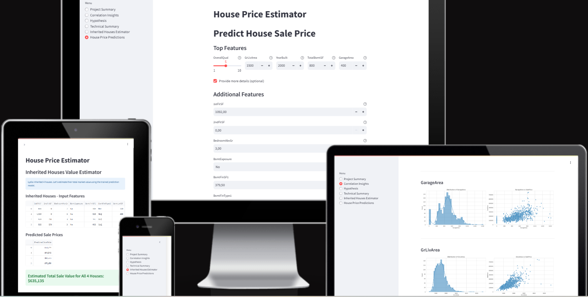

# House Price Predictor - A Regression-Based App to Estimate Home Sale Prices in Ames, Iowa

[House Price Predictor](https://house-price-predictor-3b59c8aa4c1c.herokuapp.com/)

## Table of Contents

- [Project Setup](#project-setup)
- [Dataset Content](#dataset-content)
- [Key Terms and Concepts](#key-terms-and-concepts)
- [Business Requirements](#business-requirements)
- [Hypothesis](#hypothesis-and-how-to-validate)
- [Mapping Business Requirements to Data Visualisation and ML Tasks](#mapping-business-requirements-to-data-visualisation-and-ml-tasks)
- [ML Business Case](#ml-business-case)
- [Epics and User Stories](#epics-and-user-stories)
- [Dashboard Design](#dashboard-design)
- [Technologies Used](#technologies-used)
- [Testing](#testing)
- [Issues](#issues)
- [Unfixed Bugs](#unfixed-bugs)
- [Deployment](#deployment)
- [Credits](#credits)
- [Acknowledgements](#acknowledgements)

## Project Setup

This project was built using the official [Code Institute Heritage Housing project template](https://github.com/Code-Institute-Solutions/milestone-project-heritage-housing-issues). The template provided a pre-configured development environment, including key tools such as Jupyter Notebooks, a virtual Python environment, and common data science libraries. I used it as a foundation to structure my project, manage dependencies, and streamline development in Codespaces. All template placeholder content has been removed or adapted to reflect the final implementation of my predictive analytics solution.

[Back to top](#table-of-contents)

## Dataset Content

* The dataset is sourced from [Kaggle](https://www.kaggle.com/codeinstitute/housing-prices-data). We then created a fictitious user story where predictive analytics can be applied in a real project in the workplace.
* The dataset has almost 1.5 thousand rows and represents housing records from Ames, Iowa, indicating house profile (Floor Area, Basement, Garage, Kitchen, Lot, Porch, Wood Deck, Year Built) and its respective sale price for houses built between 1872 and 2010.

|Variable|Meaning|Units|
|:----|:----|:----|
|1stFlrSF|First Floor square feet|334 - 4692|
|2ndFlrSF|Second-floor square feet|0 - 2065|
|BedroomAbvGr|Bedrooms above grade (does NOT include basement bedrooms)|0 - 8|
|BsmtExposure|Refers to walkout or garden level walls|Gd: Good Exposure; Av: Average Exposure; Mn: Minimum Exposure; No: No Exposure; None: No Basement|
|BsmtFinType1|Rating of basement finished area|GLQ: Good Living Quarters; ALQ: Average Living Quarters; BLQ: Below Average Living Quarters; Rec: Average Rec Room; LwQ: Low Quality; Unf: Unfinshed; None: No Basement|
|BsmtFinSF1|Type 1 finished square feet|0 - 5644|
|BsmtUnfSF|Unfinished square feet of basement area|0 - 2336|
|TotalBsmtSF|Total square feet of basement area|0 - 6110|
|GarageArea|Size of garage in square feet|0 - 1418|
|GarageFinish|Interior finish of the garage|Fin: Finished; RFn: Rough Finished; Unf: Unfinished; None: No Garage|
|GarageYrBlt|Year garage was built|1900 - 2010|
|GrLivArea|Above grade (ground) living area square feet|334 - 5642|
|KitchenQual|Kitchen quality|Ex: Excellent; Gd: Good; TA: Typical/Average; Fa: Fair; Po: Poor|
|LotArea| Lot size in square feet|1300 - 215245|
|LotFrontage| Linear feet of street connected to property|21 - 313|
|MasVnrArea|Masonry veneer area in square feet|0 - 1600|
|EnclosedPorch|Enclosed porch area in square feet|0 - 286|
|OpenPorchSF|Open porch area in square feet|0 - 547|
|OverallCond|Rates the overall condition of the house|10: Very Excellent; 9: Excellent; 8: Very Good; 7: Good; 6: Above Average; 5: Average; 4: Below Average; 3: Fair; 2: Poor; 1: Very Poor|
|OverallQual|Rates the overall material and finish of the house|10: Very Excellent; 9: Excellent; 8: Very Good; 7: Good; 6: Above Average; 5: Average; 4: Below Average; 3: Fair; 2: Poor; 1: Very Poor|
|WoodDeckSF|Wood deck area in square feet|0 - 736|
|YearBuilt|Original construction date|1872 - 2010|
|YearRemodAdd|Remodel date (same as construction date if no remodelling or additions)|1950 - 2010|
|SalePrice|Sale Price|34900 - 755000|

[Back to top](#table-of-contents)

## Key Terms and Concepts
- **Client**: The fictional individual (Lydia Doe) who inherited four houses and seeks pricing insights.
- **Property**: A house located in Ames, Iowa, included in the dataset.
- **Sale Price**: The amount a house was sold for. This is what we aim to predict.
- **Attribute (or Feature)**: A characteristic of a house, such as its size, number of bedrooms, or the quality of the kitchen.
- **Prediction**: An estimate of a house’s sale price based on its attributes.

[Back to top](#table-of-contents)

## Business Requirements

As a good friend, you are requested by your friend, who has received an inheritance from a deceased great-grandfather located in Ames, Iowa, to  help in maximising the sales price for the inherited properties.

Although your friend has an excellent understanding of property prices in her own state and residential area, she fears that basing her estimates for property worth on her current knowledge might lead to inaccurate appraisals. What makes a house desirable and valuable where she comes from might not be the same in Ames, Iowa. She found a public dataset with house prices for Ames, Iowa, and will provide you with that.

* 1 - The client is interested in discovering how the house attributes correlate with the sale price. Therefore, the client expects data visualisations of the correlated variables against the sale price to show that.
* 2 - The client is interested in predicting the house sale price from her four inherited houses and any other house in Ames, Iowa.

[Back to top](#table-of-contents)

## Hypothesis and how to validate?

As part of the exploratory data analysis (EDA) phase, several hypotheses were formed regarding the factors influencing house prices. These were validated using both statistical correlation analysis (Spearman and Pearson), visual insights from plots, and model-driven feature importance scores from tree-based regressors (ExtraTrees, Random Forest) and regularized linear models (Lasso, Ridge).

* H1: Houses with greater total living area (GrLivArea) are more expensive.

  * Validate:

    * **EDA Insight:** The distribution of GrLivArea is right-skewed, with most homes between 1000–2000 sq ft. Sale prices tend to increase with living area, especially below 4000 sq ft. Outliers beyond this range show more variance.

    * **Correlation:** Strong positive correlation with SalePrice (Spearman: 0.70, Pearson: 0.708).

    * **Model Insight:** Ranked among the top 5 most important features across multiple models.

  * **Conclusion:** Strongly supported — larger living area is one of the most influential predictors of house price.

* H2: Higher overall quality (OverallQual) is associated with higher sale prices.

  * Validate: 

    * **EDA Insight:** Most houses are rated 5–7 in quality. Sale price increases exponentially with quality rating, especially for homes rated 8 and above.

    * **Correlation:** Highest correlation with SalePrice (Spearman: 0.809, Pearson: 0.790).

    * **Model Insight:** Ranked as the top feature in the Extra Trees model and also prominent in Lasso/Ridge.

  * **Conclusion:** Very strongly supported — overall quality is the most powerful predictor of sale price.
* H3: Houses with a garage (GarageArea > 0) sell for higher prices than those without.

  * Validate:

    * **EDA Insight:** A positive relationship is seen between garage size and price, particularly in the 400–800 sq ft range. However, some high-priced houses lack garages, suggesting compensating factors.

    * **Correlation:** Moderate correlation with SalePrice (Spearman: 0.64, Pearson: 0.62).

    * **Model Insight:** Present but not dominant in model rankings.

  * **Conclusion:** Partially supported — garage size contributes to price but is less predictive than living area or quality. Other features can offset the absence of a garage.


[Back to top](#table-of-contents)

## Mapping Business Requirements to Data Visualisation and ML Tasks

This project addresses two key business requirements defined by the client. Each requirement is mapped to specific data science tasks involving exploratory visual analysis and machine learning modeling:

  * **Business Requirement 1:** Understand how house attributes correlate with sale price

    **Mapped to:**

      * Exploratory Data Analysis (EDA)

      * Correlation analysis (Pearson & Spearman)

      * Visualizations (scatter plots, histograms, boxplots)

      * Predictive Power Score (PPS) matrix

      * Distribution vs SalePrice plots for top features

    **Rationale:**

      * Visual and statistical tools helped identify key drivers of house prices, such as OverallQual, GrLivArea, and GarageArea.

      * Spearman and Pearson correlations quantified the strength of relationships between each feature and the target.

      * The PPS matrix offered additional insight into potential non-linear associations.

      * These findings supported the formation and validation of hypotheses and guided the choice of features for model training.
  
  * **Business Requirement 2:** Predict house sale prices

    **Mapped to:**

      * Machine Learning Regression Task

      * Model training using:

        ExtraTreesRegressor (selected as the final model)

        Lasso and Ridge Regression (to explore feature importance)

        RandomForestRegressor

      * Evaluation using MAE, RMSE, and R² metrics

      * Streamlit app for interactive prediction

    **Rationale:**

      * A broad model search was initially performed using multiple regression algorithms.

      * The top-performing models — ExtraTrees, Random Forest, and Lasso/Ridge — were further tuned and analyzed.

      * ExtraTrees was selected as the final model for its strong predictive performance and robustness.

      * Lasso and Ridge were valuable for identifying the most informative features.

      * The deployed Streamlit app enables the client to estimate sale prices by entering property details, including those of the inherited homes. 

[Back to top](#table-of-contents)

## ML Business Case

**Goal**

The goal of this machine learning task is to predict the sale price (SalePrice) of a house in Ames, Iowa, based on its physical and temporal characteristics. This directly supports the client's second business requirement: determining the combined and individual value of four inherited houses and enabling future real-time predictions for any similar property.

**Problem Framing**

  * ML Task Type: Supervised regression

  * Target Variable: SalePrice (continuous numeric value)

  * Features: House attributes (e.g., size, quality, year built) selected based on data quality, correlation with the target, and domain relevance

  * Training Data: A public dataset with ~1,500 records of residential properties in Ames, Iowa

**Model Output**

Predicts the expected sale price for:

  * Each of the four inherited houses (with known features)

  * Any other house in Ames with similar attributes

  * Enables the client to sum the total value of inherited properties

  * Powers a user-facing dashboard that supports live prediction with custom inputs

**Success Criteria**

  * Primary metric: R² score ≥ 0.75 on both train and test sets

  * Secondary metrics: Low Mean Absolute Error (MAE) and Mean Squared Error (MSE)

**Business Value**

  * Replaces guesswork with data-driven price estimates, avoiding reliance on real estate knowledge from other regions

  * Helps the client maximize profit from selling inherited houses

  * Empowers the client to assess future property opportunities using the same prediction tool

  * Delivers insights on which house features most influence sale price through data visualizations and correlation analysis


[Back to top](#table-of-contents)

## Epics and User Stories
* The project was split into 5 Epics based upon the Data Visualisation and Machine Learning tasks and within each of these, user stories were set out to enable an agile methodology.

### Epic - Information Gathering and Data Collection
  * **User Story** - As a data practitioner, I want to load the Ames Housing dataset from a reliable source, so that I can begin the analysis with a complete dataset. **Business Requirement 1 & 2**

    * Acceptance Criteria:

      1 - Dataset is successfully loaded into a Pandas DataFrame.

      2 - No file errors or loading issues.

  * **User Story** - As a data practitioner, I want to understand the structure and schema of the dataset, so that I can identify variable types and spot any immediate issues. **Business Requirement 1 & 2**

    * Acceptance Criteria:

      1- Column names, data types, and unique values are displayed.

      2- Initial inspection reveals types of variables (numerical, categorical, datetime).

  * **User Story** - As a data practitioner, I want to explore missing values and data types, so that I can determine appropriate cleaning strategies. **Business Requirement 2**

    * Acceptance Criteria:

      1- Percentage of missing values per column is calculated.

      2- Strategy for handling missing values is documented.

### Epic - Data Visualization, Cleaning, and Preparation

* **User Story** - As a data analyst, I want to visualize the most correlated variables with SalePrice, so that I can meet the client’s requirement to understand how attributes relate to house prices. **Business Requirement 1**

    * Acceptance Criteria:

      1- Perform correlation and/or PPS study.

      2- Top correlated variables are visualized against SalePrice using appropriate plots.

* **User Story** - As a data analyst, I want to clean missing values and format data types correctly, so that my dataset is ready for modeling. **Business Requirement 2**

    * Acceptance Criteria:

      1- All missing values are handled (imputed, removed, or flagged).

      2- Columns are in correct formats (e.g., numeric, categorical).
    
* **User Story** - As a data analyst, I want to transform skewed features and encode categorical variables, so that my data meets modeling assumptions. **Business Requirement 2**

    * Acceptance Criteria:

      1- Skewness is evaluated and corrected using transformations.

      2- Categorical variables are encoded using suitable encoders.

* **User Story** - As a data analyst, I want to identify the most important features for prediction, so that I can improve model accuracy and meet the dashboard requirements. **Business Requirement 2**

    * Acceptance Criteria:

      1- Feature selection is based on correlation or feature importance.

      2- Documented rationale behind selected features.

* **User Story** - As a data scientist, I want to split my dataset into train, and test sets, so that I can evaluate models on unseen data. **Business Requirement 2**

    * Acceptance Criteria:

      1- Split ratios and random seed are defined.

      2- Train/test subsets maintain integrity.

### Epic - Model Training, Optimization and Validation

* **User Story** - As a data scientist, I want to train baseline regression models, so that I can choose the most appropriate approach to predict house prices. **Business Requirement 2**

    * Acceptance Criteria:

      1- Multiple regression models (e.g., Linear, RandomForest) are trained.

      2- Initial evaluation metrics are calculated and compared.

* **User Story** - As a data scientist, I want to optimize model hyperparameters using cross-validation, so that I can maximize prediction accuracy. **Business Requirement 2**

    * Acceptance Criteria:

      1- Hyperparameter optimization is performed.

      2- R2 ≥ 0.75 is achieved on both train and test sets.

* **User Story** - As a data scientist, I want to validate the model’s performance and interpret metrics, so that I can deliver reliable results. **Business Requirement 2**

    * Acceptance Criteria:

      1- R2, RMSE, and MAE are reported.

      2- Overfitting or underfitting is addressed.

### Epic - Dashboard Planning, Designing, and Development

* **User Story** - As a dashboard developer, I want to design a dashboard structure that meets the client’s requirements, so that all requested features are implemented. **Business Requirement 1 & 2**

    * Acceptance Criteria:

      1- Includes a project summary, correlation insights, prediction page for the 4 houses, custom input page, and technical summary.

* **User Story** - As a dashboard developer, I want to visualize the top features affecting SalePrice, so that Lydia understands the most important variables. **Business Requirement 1**

    * Acceptance Criteria:

      1- Visuals include distribution, correlation and parallel plots

      2- Key insights labeled clearly.

* **User Story** - As a dashboard developer, I want to create a page where users can enter custom house attributes, so they can get real-time sale price predictions. **Business Requirement 2**

    * Acceptance Criteria:

      1- Interactive widgets allow users to input house features.

      2- Predicted price and total for 4 inherited houses are displayed.

* **User Story** - As a dashboard developer, I want to include a technical page showing model performance and pipeline steps, so that advanced users understand the modeling logic. **Business Requirement 2**

    * Acceptance Criteria:

      1- Display model pipeline, steps, and metrics.

      2- Optional: visual pipeline flow.

* **User Story** - As a user of the dashboard, I want to input the top five features affecting sale price, so that I can get a quick and reasonably accurate prediction for a property. **Business Requirement 2**

    * Acceptance Criteria:

      1- The page displays input widgets for the top 5 most important features (e.g., OverallQual, GrLivArea, etc.).

      2- A "Predict Sale Price" button triggers a prediction using a trained ML pipeline.

      3- The predicted price is displayed clearly in currency format.

      4- The model uses statistical defaults for any missing features not shown to the user.

* **User Story** - As a user of the dashboard, I want to be informed when some features were automatically filled, so that I understand the limits of prediction accuracy. **Business Requirement 2**

    * Acceptance Criteria:

      1- If any features are autofilled, a warning is displayed listing them.

      2- The user is informed that more complete data will improve the prediction quality.

      3- The full input used for the prediction (including autofills) is shown in a readable format.

* **User Story** - As a user of the dashboard, I want to optionally provide additional house features, so that the prediction is more accurate when I have more data available. **Business Requirement 2**

    * Acceptance Criteria:

      1- A checkbox labeled "Provide more details (optional)" toggles additional feature inputs.

      2- The additional inputs are based on the full set of features used during model training.

      3- If the user does not provide values for some of these, the model uses statistical defaults (median/mode) for them.

      4- Only missing (non-input) features are autofilled — the rest reflect user values.

* **User Story** - As a client or stakeholder, I want to view the project hypotheses and their validation outcomes, so that I can understand whether the data supports the initial assumptions. **Business Requirement 1**

    * Acceptance Criteria:

      1- The page clearly states the original hypotheses made at the beginning of the project.

      2- Each hypothesis is followed by a brief explanation of whether it was validated, refuted, or partially supported by the data.

      3- The conclusions are derived from relevant exploratory data analysis or statistical validation steps.

      4- The information is presented in a readable format using Streamlit components (e.g., st.success, st.warning, or st.info).

      5- The page avoids technical jargon and communicates insights clearly to non-technical stakeholders.

### Epic - Dashboard Deployment and Release

* **User Story** - As a developer, I want to deploy the dashboard on a cloud platform, so that the client can access the solution easily. **Business Requirement 2**

    * Acceptance Criteria:

      1- Hosted on Heroku.

      2- Functional and responsive.

* **User Story** - As a developer, I want to test the deployed version for performance and usability, so that I can ensure it's reliable. **Business Requirement 2**

    * Acceptance Criteria:

      1- Loads in reasonable time.

      2- Works on different screen sizes.

* **User Story** - As a data practitioner, I want to provide a usage guide or README, so Lydia knows how to navigate the dashboard. **Business Requirement 1 & 2**

    * Acceptance Criteria:

      1- Includes screenshots and usage notes.

      2- Describes limitations.

[Back to top](#table-of-contents)

## Dashboard Design

This Streamlit dashboard was designed to fulfill the business requirements defined at the beginning of the project. It offers a user-friendly, interactive experience that enables the client to explore insights and make predictions regarding house sale prices in Ames, Iowa.

**Navigation Structure**

The sidebar menu provides access to the following dashboard pages:

  * **Project Summary**

    * Brief introduction to the project.

    * Explanation of project key terms and concepts.

    * Links to full project documentation (e.g., the README).

    * Clear outline of the business requirements.
  
  * **Correlation Insights, BR1**

    <details>
    <summary>Correlation Insights - Page Image</summary>
    
    </details>


    Display of top correlated variables with SalePrice, based on:

    * Pearson Correlation

    * Spearman Correlation

    * Predictive Power Score (PPS)

    Visualizations:

    * Distribution (left) and SalePrice correlation (Right)

    * Parallel Categories Plot showing interactions between multiple features and SalePrice

    * Descriptive interpretation of how these variables impact sale price.

    <details>
    <summary>Distribution and Correlation Plots</summary>

    <p>
      
    </p>
    <p>
      
    </p>
    <p>
      
    </p>
    <p>
      
    </p>
    <p>
      
    </p>
    <p>
      
    </p>

    </details>

    <details>
    <summary>Parallel Plot</summary>
    
    </details>

  * **Hypothesis, BR1**

    <details>
    <summary>Hypothesis Page - Image</summary>
    
    </details>

    Validation of three project hypotheses using:

    * Correlation analysis

    * Feature distributions

    * Visual evidence
  
    Each hypothesis includes a conclusion section on whether it was supported or refuted by the data.
  
  * **Technical Summary, BR2**

    <details>
    <summary>Technical Summary - Page Image</summary>
    
    </details>

    * Chosen Model: ExtraTreesRegressor selected based on best cross-validation R² score and low standard deviation.

    * Comparison of baseline models:

      * Lasso: 0.8147

      * Ridge: 0.7762

      * Random Forest: 0.7853

    * Pipeline Overview:

      <details>
      <summary>Pipeline Flow</summary>
      
      </details>

      * Data preprocessing steps

      * Feature selection

      * Model training and evaluation

    * Visual representation of the pipeline flow.

    * Evaluation metrics:

      * R² score on train and test sets

      * MAE/MSE

      <details>
      <summary>Model Evaluation Image</summary>
      
      </details>

    * Summary of top 5 most important features contributing to predictions.

    <details>
    <summary>Feature Importance</summary>
    
    </details>


  * **Inherited Houses Estimator, BR2**

    <details>
    <summary>Inherited Houses Estimator - Page Image</summary>
    
    </details>

    * Table input of the 4 inherited houses’ attributes.

    * Individual predicted sale prices for each house.

    * Clear summary of the total estimated sale value for the inherited portfolio.
  
  * **House Price Predictions, BR2**

    <details>
    <summary>House Price Predictions - Page Image</summary>
    
    </details>

    * Live prediction tool to estimate the sale price of any house in Ames, Iowa.

    * Interactive input widgets for:

      * Top 5 most important features

      * Additional optional features (expandable)

  * Warnings shown if default values are used for missing inputs.

  * Output includes:

    * Predicted sale price

    * List of autofilled/defaulted features

    * Overview table of submitted input values


[Back to top](#table-of-contents)

## Technologies Used

The technologies used throughout the development are listed below:

### Languages

* [Python](https://www.python.org/)

### Python Packages

* **Data Manipulation and Analysis**

  * [Pandas](https://pandas.pydata.org/docs/index.html) – Data structures and data analysis tools.
  * [Numpy](https://numpy.org/doc/stable/index.html) – Support for large, multi-dimensional arrays and numerical operations.

* **Data Visualization**

  * [Matplotlib](https://matplotlib.org/) – 2D plotting library for creating static, animated, and interactive visualizations.
  * [Seaborn](https://seaborn.pydata.org/) – Statistical data visualization built on top of Matplotlib.
  * [Plotly](https://plotly.com/python/) – Interactive, browser-based visualizations for data analysis and dashboards.

* **Machine Learning and Evaluation**

  * [Scikit-learn](https://scikit-learn.org/stable/) – Machine learning algorithms, preprocessing, model selection, and evaluation tools.

    * LinearRegression, Lasso, Ridge
    * RandomForestRegressor, DecisionTreeRegressor
    * GradientBoostingRegressor, AdaBoostRegressor, ExtraTreesRegressor
    * GridSearchCV, train_test_split, SelectFromModel
    * r2_score, mean_squared_error, mean_absolute_error
    * Pipeline, StandardScaler
  
  * [XGBoost](https://xgboost.readthedocs.io/en/stable/) – Scalable and optimized gradient boosting machine learning library.

* **Feature Engineering and Preprocessing**

  * [Feature-engine](https://feature-engine.trainindata.com/en/latest/) – Tools for feature transformation, encoding, outlier handling, and selection.

    * MeanMedianImputer, CategoricalImputer, ArbitraryNumberImputer
    * OrdinalEncoder, OneHotEncoder
    * PowerTransformer, BoxCoxTransformer, YeoJohnsonTransformer, LogTransformer
    * Winsorizer
    * ArbitraryDiscretiser, SmartCorrelatedSelection
    * DropFeatures

* **Statistical Analysis**

  * [SciPy](https://docs.scipy.org/doc/scipy/) – Scientific and technical computing, including statistical functions (scipy.stats).

* **Profiling and Reports**

  * [YData Profiling](https://ydata.ai/docs/knowledge/reports/profiling/) – Automatically generates detailed exploratory data analysis (EDA) reports.

* **Predictive Power Score**

  * [ppscore](https://pypi.org/project/ppscore/) – Score to identify predictive power of features (handles linear and non-linear relationships).

* **Web Application / Dashboard**

  * [Streamlit](https://docs.streamlit.io/) – Fast way to build and share data apps in Python.

* **Other Utilities**

  * [Joblib](https://joblib.readthedocs.io/en/latest/) – Serialization and persistence for machine learning models and pipelines.
  * [OS](https://docs.python.org/3/library/os.html) – Operating system interfaces.
  * [Warnings](https://docs.python.org/3/library/warnings.html) – Used to handle warning messages.
  * [Zipfile](https://docs.python.org/3/library/zipfile.html) – For extracting zipped files (used with Kaggle datasets).

### Other Technologies

* [Git](https://git-scm.com/) - For version control
* [GitHub](https://github.com/) - Code repository and GitHub projects was used as a Kanban board for Agile development
* [Heroku](https://heroku.com) - For application deployment
* [VSCode](https://code.visualstudio.com/) - IDE used for development
* [Am I Responsive](https://ui.dev/amiresponsive) - To show the website image on a range of devices.

[Back to top](#table-of-contents)

## Testing

### Manual Testing

#### User Story Testing

* Dashboard and Jupyter notebooks were manually tested using user stories as a basis for determining success.

*As a data practitioner, I want to load the Ames Housing dataset from a reliable source, so that I can begin the analysis with a complete dataset.*

| Feature | Action | Expected Result | Actual Result |
| --- | --- | --- | --- |
| Load Ames housing dataset  | Load Ames housing dataset in Data Collection Notebook | Dataset is successfully loaded into a Pandas DataFrame. No file errors or loading issues. | Pass |

---

*As a data practitioner, I want to understand the structure and schema of the dataset, so that I can identify variable types and spot any immediate issues.*

| Feature | Action | Expected Result | Actual Result |
| --- | --- | --- | --- |
| Dataset structure and schema | understand the structure and schema of the dataset | Column names, data types, and unique values are displayed. Data Types are identified (Data Collection Notebook) | Pass |

---

*As a data practitioner, I want to explore missing values and data types, so that I can determine appropriate cleaning strategies.*

| Feature | Action | Expected Result | Actual Result |
| --- | --- | --- | --- |
| explore missing values and data types | Load dataset into a DataFrame. Use df.info() and df.isnull().mean()*100 to inspect data types and missing values. | Percentage of missing values per column is calculated. Strategy for handling missing values is documented. | Pass |

---

*As a data analyst, I want to visualize the most correlated variables with SalePrice, so that I can meet the client’s requirement to understand how attributes relate to house prices.*

| Feature | Action | Expected Result | Actual Result |
| --- | --- | --- | --- |
| Visualize most correlated features | Run correlation analysis (.corr() and ppscore.matrix()), then plot top correlated variables using scatter plots, boxplots, and heatmaps. | Perform correlation and PPS study. Top correlated variables are visualized against SalePrice using appropriate plots. | Pass |

---

*As a data analyst, I want to clean missing values and format data types correctly, so that my dataset is ready for modeling*

| Feature | Action | Expected Result | Actual Result |
| --- | --- | --- | --- |
| Handle missing values & fix data types | Apply appropriate imputation strategies (mean/median/mode), drop unneeded columns, convert types. | All missing values are handled (imputed, dropped, or flagged). Columns are in correct formats. | Pass |

---

*As a data analyst, I want to transform skewed features and encode categorical variables, so that my data meets modeling assumptions.*

| Feature | Action | Expected Result | Actual Result |
| --- | --- | --- | --- |
| Transform skewed features and encode categoricals | Evaluate skewness with histograms/stats; apply Box-Cox, Yeo-Johnson, or log transforms. Use Ordinal or OneHotEncoder where appropriate. | Skewness is evaluated and corrected using transformations. Categorical variables are encoded using suitable encoders. | Pass |

---

*As a data analyst, I want to identify the most important features for prediction, so that I can improve model accuracy and meet the dashboard requirements.*

| Feature | Action | Expected Result | Actual Result |
| --- | --- | --- | --- |
| Identify top predictive features | Use correlation matrix, PPS, and model-based feature importance (e.g., ExtraTrees). Document selection criteria. | Feature selection is based on correlation or feature importance. Documented rationale behind selected features. | Pass |

---

*As a data scientist, I want to split my dataset into train, and test sets, so that I can evaluate models on unseen data.*

| Feature | Action | Expected Result | Actual Result |
| --- | --- | --- | --- |
| Train/test split | Use train_test_split() from sklearn.model_selection with a defined test size and random seed. Validate class distribution and row count. | Split ratios and random seed are defined. Train/test subsets maintain integrity. | Pass |

---

*As a data scientist, I want to train baseline regression models, so that I can choose the most appropriate approach to predict house prices.*

| Feature | Action | Expected Result | Actual Result |
| --- | --- | --- | --- |
| Train baseline models | Implement and train multiple regressors (e.g., LinearRegression, RandomForestRegressor). Evaluate using cross-validation and record metrics. |  Multiple regression models (e.g., Linear, RandomForest) are trained. Initial evaluation metrics are calculated and compared. | Pass |

---

*As a data scientist, I want to optimize model hyperparameters using cross-validation, so that I can maximize prediction accuracy.*

| Feature | Action | Expected Result | Actual Result |
| --- | --- | --- | --- |
| Hyperparameter optimization | Use GridSearchCV to tune model parameters. Evaluate best model on train/test sets. | Hyperparameter optimization is performed. R2 ≥ 0.75 is achieved on both train and test sets. | Pass |

---

*As a data scientist, I want to validate the model’s performance and interpret metrics, so that I can deliver reliable results.*

| Feature | Action | Expected Result | Actual Result |
| --- | --- | --- | --- |
| Model evaluation | Evaluate trained model using R², RMSE, and MAE on both train and test sets. | R², RMSE, and MAE are reported. Overfitting or underfitting is addressed. | Pass |

---

*As a dashboard developer, I want to design a dashboard structure that meets the client’s requirements, so that all requested features are implemented.*

| Feature | Action | Expected Result | Actual Result |
| --- | --- | --- | --- |
| Dashboard navigation | Navigate through the Streamlit sidebar and verify the presence of all required pages | Pages included: Project Summary, Correlation Insights, Hypotheses, Technical Summary, Inherited Houses Estimator, House Price Predictions | Pass |

---

*As a dashboard developer, I want to visualize the top features affecting SalePrice, so that Lydia understands the most important variables.*

| Feature | Action | Expected Result | Actual Result |
| --- | --- | --- | --- |
| Feature importance plot | Navigate to the Technical Summary page and review the bar chart for top 5 features | Visuals include bar plots of feature importances. Key insights are labeled clearly with readable titles and axes. | Pass |

---

*As a dashboard developer, I want to create a page where users can enter custom house attributes, so they can get real-time sale price predictions.*

| Feature | Action | Expected Result | Actual Result |
| --- | --- | --- | --- |
| House Price Predictions (individual) | Go to the House Price Predictions page. Input custom house features using the form and submit. | Interactive widgets accept inputs for top features. A predicted sale price is shown for the custom house. | Pass |
| Inherited Houses Estimator (4 inherited homes) | Go to the Inherited Houses Estimator page. Review the displayed predictions for the four inherited houses. | Predicted sale prices for each of the 4 houses are shown. A total sale price is also displayed at the bottom. | Pass |

---

*As a dashboard developer, I want to include a technical page showing model performance and pipeline steps, so that advanced users understand the modeling logic.*

| Feature | Action | Expected Result | Actual Result |
| --- | --- | --- | --- |
| Technical Summary Page | Go to the Technical Summary page. Review the model pipeline, steps, and evaluation metrics. | The page displays a summary of the preprocessing and modeling pipeline, step-by-step descriptions, model performance metrics (e.g. MAE, R²), and a visual representation of the pipeline flow. | Pass |

---

*As a user of the dashboard, I want to input the top five features affecting sale price, so that I can get a quick and reasonably accurate prediction for a property.*

| Feature | Action | Expected Result | Actual Result |
| --- | --- | --- | --- |
| Top 5 Feature Input & Prediction | Go to the House Price Predictions page. Input values for the top 5 most important features and click "Predict Sale Price." | The page displays input widgets for the top 5 most important features (e.g., OverallQual, GrLivArea, etc.). A "Predict Sale Price" button triggers a prediction using a trained ML pipeline. The predicted price is shown clearly in currency format. The model fills in all other features with statistical defaults from the training data (e.g., median or mode). | Pass |

---

*As a user of the dashboard, I want to be informed when some features were automatically filled, so that I understand the limits of prediction accuracy.*

| Feature | Action | Expected Result | Actual Result |
| --- | --- | --- | --- |
| Autofill Notification & Summary | On the House Price Predictions page, leave some optional fields blank and click "Predict Sale Price." | If any features were autofilled, a warning message is displayed listing those features. The user is clearly informed that filling more features may improve prediction accuracy. Below the prediction, the full feature input used in the model (including autofills) is shown in a readable table. | Pass |

---

*As a user of the dashboard, I want to optionally provide additional house features, so that the prediction is more accurate when I have more data available.*

| Feature | Action | Expected Result | Actual Result |
| --- | --- | --- | --- |
| Optional Additional Feature Input | Go to the House Price Predictions page. Click the checkbox labeled "Provide more details (optional)" to reveal more input fields. Fill in some (but not all) of the additional fields, then click "Predict Sale Price." | A checkbox labeled "Provide more details (optional)" toggles visibility of additional input fields. These inputs are based on the full set of features used in model training. Any missing (non-input) fields are automatically filled using statistical defaults (median or mode). The prediction reflects both user-provided and autofilled values, and only the missing fields are noted in the autofill warning. | Pass |

---

*As a client or stakeholder, I want to view the project hypotheses and their validation outcomes, so that I can understand whether the data supports the initial assumptions.*

| Feature | Action | Expected Result | Actual Result |
| --- | --- | --- | --- |
| Hypothesis Validation Page | Go to the Hypotheses page in the dashboard. Review the listed hypotheses and their outcomes. | The page clearly presents the original project hypotheses made during the initial planning phase. Each hypothesis is followed by a concise explanation of whether it was validated, refuted, or partially supported by the data. Each outcome is supported by relevant EDA or statistical checks. The insights are communicated using Streamlit components (e.g., st.success, st.warning, st.info) in plain language, accessible to non-technical users. | Pass |

---

*As a developer, I want to deploy the dashboard on a cloud platform, so that the client can access the solution easily.*

| Feature | Action | Expected Result | Actual Result |
| --- | --- | --- | --- |
| Cloud Deployment | Open the dashboard via the Heroku app link on a browser. Test page navigation and interactivity on desktop and mobile. | The dashboard is successfully hosted on Heroku, loads without errors, and is functional and responsive across devices. All pages (e.g., project summary, predictions, hypotheses) are accessible. | Pass |

---

*As a developer, I want to test the deployed version for performance and usability, so that I can ensure it's reliable.*

| Feature | Action | Expected Result | Actual Result |
| --- | --- | --- | --- |
| Performance & Usability Test | Open the deployed dashboard on Heroku from various devices (desktop, tablet, mobile). Test page loads, navigation, and responsiveness. | The dashboard loads in a reasonable time (within a few seconds), responds smoothly to user interactions, and adapts correctly to different screen sizes without layout or content issues. | Pass |

---

*As a data practitioner, I want to provide a usage guide or README, so Lydia knows how to navigate the dashboard.*

| Feature | Action | Expected Result | Actual Result |
| --- | --- | --- | --- |
| Dashboard Usage Guide | Open the provided README file or usage instructions section on the deployed dashboard | The README includes clear usage instructions, screenshots of each main page, a description of each feature, and notes on any known limitations or assumptions. The guide is easy to follow for non-technical users like Lydia. | Pass |

[Back to top](#table-of-contents)

### Validation

All code in the app_pages and src directories was validated as conforming to PEP8 standards using [Code Institute CI Python Linter](https://pep8ci.herokuapp.com/).

### Automated Unit Tests

No automated unit tests have been carried out at this time.

[Back to top](#table-of-contents)

## Issues

**Issue 1: Duplicate Index Labels Causing Reindexing Error in Seaborn**

**Error Message:**

`ValueError: cannot reindex on an axis with duplicate labels`

**Context:**

While comparing the distributions of original vs. cleaned categorical variables, we created two separate DataFrames:

```
df1 = pd.DataFrame({"Type": "Original", "Value": df_original[var]})
df2 = pd.DataFrame({"Type": "Cleaned", "Value": df_cleaned[var]})
dfAux = pd.concat([df1, df2], axis=0)

```

However, since both `df1` and `df2` originated from DataFrames with identical indices, `pd.concat()` preserved these indices, resulting in duplicate index labels.

When this concatenated DataFrame (`dfAux`) was passed to `seaborn.countplot()`, Seaborn attempted to internally reindex the data. The presence of non-unique indices led to ambiguity during this reindexing process, triggering the `ValueError`.

**Solution:**

To prevent this issue, we reset the index after concatenation:

```
dfAux = pd.concat([df1, df2], axis=0).reset_index(drop=True)

```

This ensured the resulting DataFrame had a clean, unique index, allowing Seaborn to operate without ambiguity.

---

**Issue 2: `st.set_page_config()` Must Be Called First in Streamlit**

**Error Message:**

`StreamlitSetPageConfigMustBeFirstCommandError: set_page_config() can only be called once per app page, and must be called as the first Streamlit command in your script.`

**Context:**

During development, this error occurred because `st.set_page_config()` was placed within the `__init__()` method of the `MultiPage` class inside `multipage.py`. Since this class was instantiated after other Streamlit commands had already been executed, it violated Streamlit's requirement that `set_page_config()` must be the very first Streamlit command run in the script.

**Solution:**

To resolve this:

1. The call to `st.set_page_config()` was moved to the very top of `app.py`, before any other Streamlit commands or imports:

```
import streamlit as st
st.set_page_config(page_title="House Price Estimator", page_icon="🏘️", layout="centered")

```

2. The duplicate call inside `multipage.py` was removed to ensure `set_page_config()` is executed only once, and at the appropriate time.

[Back to top](#table-of-contents)

## Unfixed Bugs

* At the time of writing, there are no unfixed bugs within the project.

[Back to top](#table-of-contents)

## Deployment

### Heroku


This project was deployed on Heroku to make the Streamlit dashboard publicly accessible.

**Live App:** [House Price Predictor](https://house-price-predictor-3b59c8aa4c1c.herokuapp.com/)

#### Steps to Deploy:

To deploy this project to [Heroku](https://www.heroku.com/) using [GitHub](https://github.com/) integration, the following setup and configurations were implemented:

1. Setup Deployment Files

Ensure the following files exist in your project root:

* `setup.sh` – Configures Streamlit server settings for Heroku:

```
mkdir -p ~/.streamlit/
echo "\
[server]\n\
headless = true\n\
port = $PORT\n\
enableCORS = false\n\
\n\
" > ~/.streamlit/config.toml
```

* `Procfile` – Defines the process Heroku should run:

```
web: sh setup.sh && streamlit run app.py
```

* `runtime.txt` – Specifies the Python version for Heroku build:

´´´
python-3.10.12

´´´

* `requirements.txt` – Lists all Python packages required for the project.

* `python-version` – Set to a Heroku-supported version (e.g., `3.10.12`) if required for development consistency.

* `.gitignore` / `.slugignore` – Ensure large files or local-only files are excluded from Git pushes and deployment slugs to avoid size issues.

2. Connect GitHub Repo to Heroku

  * Log in to your Heroku dashboard.

  * Create a new app and give it a unique name.

  * Under the Deploy tab, choose GitHub as the deployment method.

  * Connect to your GitHub repository.

  * Select the desired branch and click Deploy Branch.

  * Once deployment is successful, click "Open App" to launch it.

**Troubleshooting:**

* Slug too large?

  Add unnecessary or development-only files (e.g., datasets, notebooks) to your `.slugignore` file.

* App not launching?

  Ensure `requirements.txt`, `Procfile`, and `setup.sh` are correctly formatted and present in the root directory.

[Back to top](#table-of-contents)

## Forking and Cloning
If you wish to fork or clone this repository, please follow the instructions below:

### Forking

To create your own copy of this repository:

1. Log in to [GitHub](https://github.com/).

2. Navigate to the [Heritage House Price Insight Predictor repository](https://github.com/Fariba-Kamani/Heritage-House-Price-Insight-Predictor).

3. Click the Fork button at the top-right corner.

4. GitHub will create a copy of the repository under your own account.

You can now clone your forked version to your local machine and begin working on it.

### Cloning

To clone this project to your local machine:

1. Navigate to the GitHub repository (either the original or your forked version).

2. Click the green `<> Code` button and copy the URL under the HTTPS tab.

3. Open your terminal and navigate to the directory where you'd like to clone the project.

4. Run the following command (replace `<your-username>` if cloning your own fork):

```
git clone https://github.com/<your-username>/Heritage-House-Price-Insight-Predictor.git

```

5. Navigate into the cloned project folder:

```
cd Heritage-House-Price-Insight-Predictor

```

**Optional tip:** If you're contributing to this project, it's good practice to create a virtual environment and install the requirements:

```
python -m venv .venv
source .venv/bin/activate  # On Windows: .venv\Scripts\activate
pip install -r requirements.txt

```

### Installing Requirements

**Note:** The `requirements.txt` file only includes the minimum packages needed for deploying the dashboard to Heroku, due to Heroku's slug size limitations.

To install all required dependencies for local development and full functionality, run the following command in your terminal:

In order to ensure all the correct dependencies are installed in your local environment, run the following command in the terminal:

```
pip install -r full-requirements.txt

```

If you're only deploying the dashboard and want the lighter set of dependencies:

```
pip install -r requirements.txt

```

[Back to top](#table-of-contents)

## Credits

### Content

This project was built as part of the Code Institute's Predictive Analytics and Machine Learning module. It closely followed the structure and best practices outlined in the course content and walkthrough projects, including:

The `Churnometer` and the `Streamlit Calculator` walkthrough projects – for notebook structure, data processing logic, and dashboard design inspiration.

The Code Institute Machine Learning Project Template – used to set up the working directory and folder structure.

Throughout the Jupyter notebooks, I have reused and adapted several custom functions and best practices introduced in Code Institute materials:

* **EDA Correlation PPS Study Notebook**

  `plot_categorical()` and `plot_numerical()` functions used to display feature distributions by target (SalePrice) were inspired by the `plot_categorical()` and `plot_numerical()` functions used in the churned_customer_study.ipynb from Churnometer.

* **Data Cleaning Notebook**

  `correlation analysis, and PPS` function to generate Pearson/Spearman and PPS heatmaps, and `assessing missing data levels` function were reused from Churnometer’s cleaning notebook.

* **Feature Engineering Notebook**

  Exploratory feature engineering function taught in Feature Engineering lessons was reused to study the effect of transformations such as `numerical`, `ordinal_encoder`, and `outlier_winsorizer`.

  Used `SmartCorrelatedSelection()` from `feature_engine.selection`, introduced in the lessons, to remove multicollinear features.

* **Modeling and Evaluation Notebook**

  `Hyperparameter optimization` and `performance evaluation` functions were adapted from the churnometer-modeling_and_evaluation notebooks. 
  Model documentation and `hyperparameter optimization` were supported by references to official Scikit-learn documentation: [ExtraTreesRegressor](https://scikit-learn.org/stable/modules/generated/sklearn.ensemble.ExtraTreesRegressor.html), [RandomForestRegressor](https://scikit-learn.org/stable/modules/generated/sklearn.ensemble.RandomForestRegressor.html), [Lasso Regression](https://scikit-learn.org/stable/modules/generated/sklearn.linear_model.Lasso.html), [Ridge Regression](https://scikit-learn.org/stable/modules/generated/sklearn.linear_model.Ridge.html).
  These resources were particularly helpful in defining the model parameters for `GridSearchCV` and understanding the estimators' behavior for extensive search tuning.

* **Dashboard**

  The overall structure, use of `MultiPage` pattern, and sidebar navigation were based on the multi-page implementation in the `Churnometer Streamlit dashboard` and the `Streamlit Calculator` walkthrough.

* **README**

  This README structure follows Code Institute’s documentation standards and takes inspiration from, the sample README of [CVD Predictor](https://github.com/jfpaliga/CVD-predictor/blob/main/README.md) shared by my mentor, and my own previous README files created during the bootcamp.

* **Additional Support**

  ChatGPT (OpenAI) was used for guidance, debugging, and documentation refinement throughout the project.


[Back to top](#table-of-contents)

## Acknowledgements

Thanks to my mentor Mo Shami for his feedback, encouragement, and help during the development of this project.

[Back to top](#table-of-contents)


